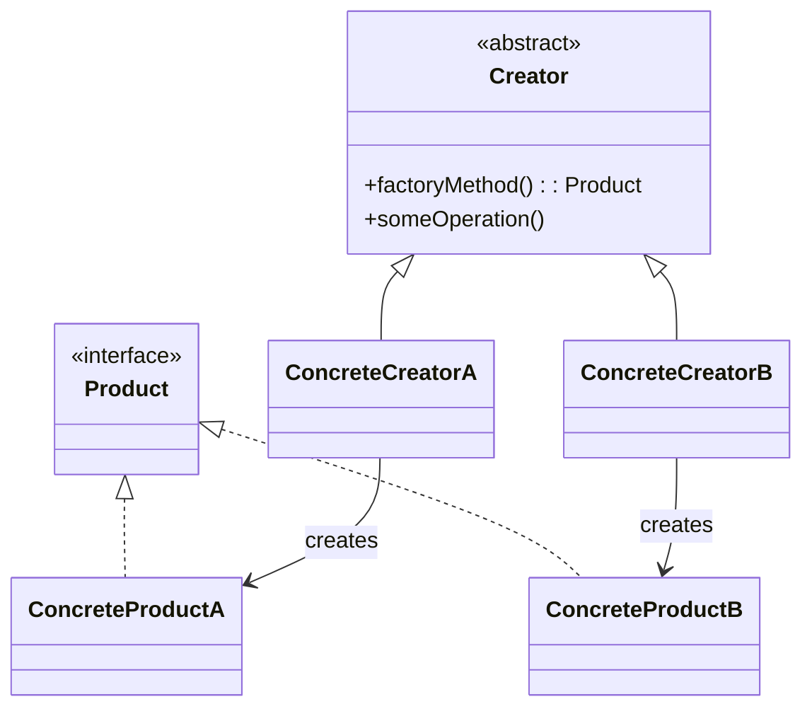

# Patrón de Diseño: Factory Method

## 📘 Descripción
El patrón Factory Method permite delegar la creación de objetos a las subclases, evitando acoplar el código cliente a clases concretas. Promueve la extensibilidad y la adherencia al principio "Programa a una interfaz, no a una implementación".

## 🎯 Objetivo del Ejercicio

**Título:** Sistema de generación de reportes con diferentes formatos

**Descripción:**  
Diseña e implementa (en el lenguaje que prefieras) un pequeño subsistema para **generar reportes** que pueden exportarse en **PDF**, **HTML** o **CSV**. La lógica principal del reporte (recolección de datos y formateo lógico) debe estar en una clase `ReportGenerator` que no conozca las clases concretas de exportación. El patrón a usar es **Factory Method**: `ReportGenerator` declara `createExporter()` y las subclases concretas devuelven `PdfExporter`, `HtmlExporter` o `CsvExporter`.

**Requisitos funcionales**

1.  `ReportGenerator` tiene un método `generateReport(data)` que obtiene datos y los fluye al `Exporter` retornado por `createExporter()`.
    
2.  `Exporter` es una interfaz con un método `export(reportContent, destination)`.
    
3.  Implementar tres `ConcreteCreator`:
    
    -   `PdfReportGenerator` → devuelve `PdfExporter`.
        
    -   `HtmlReportGenerator` → devuelve `HtmlExporter`.
        
    -   `CsvReportGenerator` → devuelve `CsvExporter`.
        
4.  Añadir una opción de configuración (por archivo o parámetro) que permita instanciar el `ReportGenerator` apropiado sin cambiar código cliente.
    
5.  Documentar cómo agregar un nuevo formato (por ejemplo, `XLSX`) sin modificar `ReportGenerator`.

## 🪜 Pasos sugeridos
1.  Definir la interfaz `Exporter`.
2.  Implementar `PdfExporter`, `HtmlExporter`, `CsvExporter` (simulación aceptable: crear archivos con estructura representativa).
3.  Crear `ReportGenerator` abstracto con `createExporter()` abstracto y `generateReport(data)` que utiliza el `Exporter`.
4. Crear tres `ConcreteCreator` que sobreescriben `createExporter()`.
5. Implementar un `FactoryProvider` o configuración que devuelva la instancia adecuada según parámetros.
## 💬 Preguntas de análisis
- ¿Qué ventajas ofrece este patrón frente a la creación directa de objetos?
- ¿Qué principio SOLID se refuerza?
- ¿Qué tan sencillo es agregar un nuevo tipo de notificación?

## ✅ Criterios de evaluación
- Correcta aplicación del patrón.
- Código desacoplado de las clases concretas.
- Extensibilidad sin modificar el cliente.
- Documentación clara y estructurada.
